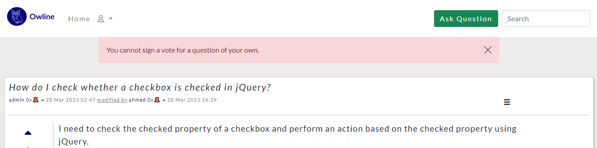
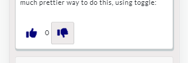
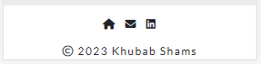

<kbd></kbd>

[Owline Live Site](https://owline.herokuapp.com)

# Table of Contents

- [Table of Contents](#table-of-contents)
- [Overview](#overview)
- [Goals](#goals)
  - [User's Goals](#users-goals)
  - [Site Owner's Goals](#site-owners-goals)
- [User Stories](#user-stories)
  - [Anonymous User](#anonymous-user)
  - [Logged-in User](#logged-in-user)
  - [Admin User](#admin-user)
  - [Site Owner](#site-owner)
- [Design](#design)
  - [Frontend](#frontend)
    - [Colours](#colours)
    - [Font](#font)
  - [Backend](#backend)
    - [Data Models](#data-models)
- [Technologies](#technologies)
  - [Django Framework](#django-framework)
  - [Python](#python)
  - [Other Software and Tools](#other-software-and-tools)
- [Features](#features)
  - [Existing Features](#existing-features)
    - [Navbar](#navbar)
    - [Signup](#signup)
    - [Login](#login)
    - [Notifications](#notifications)
    - [Search Questions](#search-questions)
    - [Ask Questions](#ask-questions)
    - [Answer Questions](#answer-questions)
    - [Imporve Question/ Answer](#imporve-question-answer)
    - [Delete Question/ Answer](#delete-question-answer)
    - [Register Votes](#register-votes)
    - [Accept Answers](#accept-answers)
    - [Contact Us](#contact-us)
    - [Inbox](#inbox)
    - [Footer](#footer)
  - [Features Left to Implement](#features-left-to-implement)
    - [Tags](#tags)
    - [Reply to User Messages](#reply-to-user-messages)
- [Validations](#validations)
  - [Python](#python-1)
  - [Javascript](#javascript)
  - [HTML](#html)
  - [CSS](#css)
  - [Accessability](#accessability)
  - [Lighthouse](#lighthouse)
- [Testing](#testing)
  - [Manual Testing of User Stories](#manual-testing-of-user-stories)
  - [Automated Testing](#automated-testing)
  - [Bugs](#bugs)
- [Login Credentials](#login-credentials)
- [Configurations](#configurations)
  - [Fork This Repository](#fork-this-repository)
  - [Make Local Clone](#make-local-clone)
  - [Deployment](#deployment)
- [Credits](#credits)
  - [Media](#media)
  - [Docs](#docs)
  - [Code](#code)
  - [Acknowledgements](#acknowledgements)

# Overview

Owline is an online forum for all internet users. People can find answers to their questions or help others by answering their inquiries. Users can also improve posted content and promote a question or an answer positively or negatively. Admin users can organise and control content by removing irrelevant, out-of-point, and disturbing posts.

# Goals

## User's Goals

1. Read questions and explore answers.
2. Search and ask questions.
3. Answer others' questions and discuss topics.

## Site Owner's Goals

1. Provide an online discussion platform.
2. Build a direct simple website that fulfill the users' needs.
3. Create a direct channel of messaging with the users.

# User Stories

## Anonymous User

1. I can view and filter the listed questions so that I will be able to read them. 
2. I can be able to open a question's details so that I can read the answers. 
3. I can sign up so that I can access more of the site's features. 
4. I can be logged in so that I can ask or answer questions. 
5. I can search for specific questions so that I will avoid question duplication. 

## Logged-in User

6. I can ask a question so that I can get an answer. 
7. I can edit a question so that it is more clearly answered. 
8. I can answer a question so that my answer could help someone. 
9. I can edit an answer so that they are more clarified and updated. 
10. I can accept one of my questions' answers so that other users know it helped me. 
11. I can upvote or downvote a question or answer to show how much this question or answer is helpful. 
12. I can see the vote score of my questions and answers on my profile, so I'll be encouraged to create more helpful questions and answers. 
13. I can contact the site's admin so that I can report an issue with the website or its content. 

## Admin User

14. I can delete duplicated or irrelevant questions so that users focus on answering valuable ones. 
15. I can delete the irrelevant answers so that they won't distract users. 
16. I can reply to users' messages so that I provide them with the required feedback and support. 

## Site Owner

17. I want users to be able to open the site on their mobile phone or tablet so that they'll have the same experience as on a desktop. 
18. I want users to be able to open any page wherever they are so that navigating through the site will be easy. 
19. I want users to be able to get feedback on their actions so that they'll know if their action was successfully completed or failed. 
20. I want users to see the site's text fonts and colours clearly so that they can focus on the content without distraction. 
    

# Design

## Frontend

### Colours

The colour scheme created for the site is contrasted, which provides better accessibility and helps the user have a comfortable experience.

  
The Colour Scheme

### Font

The font used in this site is "Lato," which is a sans-serif, clean font that's commonly used in blogs and writing.
Different styles of the Lato font have been used:

  
Headers and Titles

  
Navbar, Footer, Questions and Answers

## Backend

### Data Models

Models have been developed following OOP concepts, trying to secure better maintenance and reduce redundancy.

  
Models' Details

 
  - Classes `BasePost`, `Question` and `Answer` developed in `forum` app, `Message` in `contact_us` and `Profile` in `home` app.
  - `BasePost` is the parent class of `Answer`  and `Question`, it contains their main attributes.
  - `Profile` is created to extend built-in `User` class features; a `Profile` record is created and linked with `User` each time the latter is created.
  - Each model, except `Profile` and `BasePost`, has different types of generic views developed.
  - Unit tests for `forum` app are created by inheriting the main test class, which contains test setup and inherits built-in `TestCase`.  

  
Class Diagram For Models

# Technologies

## Django Framework

- Django Python Web Framework has been used to develop this site.
- Version: 3.2.18

## Python

- is the programming language used to develop the models and views of this site.
- Version: 3.8.11

## Other Software and Tools

- [Django Markup](https://pypi.org/project/django-markupfield/): used to create markdown-supported text fields.
- [Coverage](https://pypi.org/project/coverage/): used to check the coverage of the automation testing of the Python classes.
- [Pycodestyle](https://pypi.org/project/pycodestyle/): is used to hint syntax errors and warnings in Python code.
- [Bootstrap](https://getbootstrap.com): is used for styling and providing an appealing site.
- [Badge Generator](https://badgesgenerator.com/): is used to generate markdown badges for Readme's user stories.
- [Markdown All in One Extension](https://open-vsx.org/vscode/item?itemName=yzhang.markdown-all-in-one): used to help in writing the readme.
- [Github](https://github.com/): used as a version control management tool.
- [Gitpod](https://www.gitpod.io): used as a development environment.
- [Heroku](https://www.heroku.com/): is used to deploy this site.
- [ElephantSQL](https://www.elephantsql.com/): used as a PostgreSQL database service.
- [Cloudinary](https://cloudinary.com/): is used to provide storage for the static files.
- [Dia](http://dia-installer.de/): used to design models' class diagrams.
- [Canva](https://www.canva.com/): used to design the logo and the colour scheme.
- [Font Awesome](https://fontawesome.com/): icons provided by Font Awesome were used in this site.
- [Freepik](https://www.freepik.com/): is used to get illustration images.
- [Cool Symbol](https://coolsymbol.com/): used to copy text symbols.
- [Google Fonts](fonts.google.com): the used font is imported from the Google Fonts library.
- [Quillbot](https://quillbot.com/grammar-check) and [Grammarly](https://app.grammarly.com/): used to fix spelling and grammar mistakes.
- [Am I Responsive](https://ui.dev/amiresponsive): used to generate multi-screen site previews.
- [Favicon Generator](https://www.favicon-generator.org/): used to create favicons suitable for different device dimensions.
- [Jigsaw CSS Validator](https://jigsaw.w3.org/css-validator/): used to discover errors in CSS stylesheets.
- [Nu Html Checker](https://validator.w3.org/nu/): used to discover errors in HTML syntax.
- [WAVE](https://wave.webaim.org/): has been used as an accessibility evaluation tool.
- [Google Chrome Lighthouse](https://developer.chrome.com/docs/lighthouse/overview/): is used to generate reports for performance, accessibility, best practises, and SEO.
- [Google Chrome DevTools](https://developer.chrome.com/docs/devtools/): used to test website responsiveness and debug styling issues.
- [JSHint](https://jshint.com/): used to find Javascript code errors.

# Features

## Existing Features

### Navbar

- The navbar contains links to all site features such as the home page, account options, search and create questions, and admins' message inbox.It was developed to be responsive and simple.
- _user stories covered: 17,18_

Navbar on Desktop

Navbar on Mobile

### Signup

- Users with no accounts can sign up with a single form and a straightforward process. They'll need only to enter the username, email, password and a passowrd confirmation.
- _user story covered: 3_

Singup on Desktop

Singup on Mobile

### Login

- To be able to use most sites' features, users have to be logged in. The process requires only entering a username and password and whether they want to keep their accounts logged in by clicking on the 'Remember Me' option.
- _user stories covered: 4_

Login on Desktop

Login on Mobile

### Notifications

- Messages are shown on each user action to let them know whether their action succeeded or failed and what happened when it didn't work.
- _user stories covered: 19_

Notifications on Desktop

Notifications on Mobile

### Search Questions

- Users can search for specific questions by entering some keywords. This will help users by saving time to get answers, and admins by avoiding the need to duplicate questions.
- _user stories covered: 1,2,5_

Search on Desktop

Search on Mobile

### Ask Questions

- Logged-in Users who cannot find an available answer to their question by searching can create a new question and wait for other users replies.
- They need to enter the title of the question, which is a brief description of what they are asking, and the body, which is an explanation in details of their issue or problem.
- _user stories covered: 6_

Question on Desktop

Question on Mobile

### Answer Questions

- Logged-in Users who are knowledgeable about the topic of the question can respond to it to assist the asker and other readers who are experiencing similar problems. 
- _user stories covered: 8_

Answer on Desktop

Answer on Mobile

### Imporve Question/ Answer

- Unclear questions are more likely to be answered correctly, and unclear answers won't provide the asker with the information needed. Logged-in users can update each other's questions or answers to simplify them and provide more clarity.
- _user stories covered: 7,9_

Question Update on Desktop

Question Update on Mobile

Answer Update on Desktop

Answer Update on Mobile

### Delete Question/ Answer

- Deleting out of topic or duplicated questions or answers will help organising the content on site and control the language used on it.
- _user stories covered: 14,15_

Question Delete on Desktop

Question Delete on Mobile

Answer Delete on Desktop

Answer Delete on Mobile

### Register Votes

- Voting are used in this site to provide a feedback on question or answer. Logged-in users can upvote or downvote depends on their experience with the answer or the way a question is presented.
- Users can see the vote score of their questions and answers attached to their usernames.
- _user stories covered: 11,12_

Question Upvote on Desktop

Question Upvote on Mobile

Question Downvote on Desktop

Question Downvote on Mobile

Answer Upvote on Desktop

Answer Upvote on Mobile

Answer Downvote on Desktop

Answer Downvote on Mobile

### Accept Answers

- Answers can be accepted by questions' owners, which make it easier for other users to distinguish the best answer, which has helped the asker more.
- _user stories covered: 10_

Answer Accept on Desktop

Answer Accept on Mobile

### Contact Us

- Logged-in users can send messages directly to the sites' administrators, providing feedback or reporting an issue on the site.
- _user stories covered: 13_

Message on Desktop

Message on Mobile

### Inbox
- Admin users can find users' messages in the inbox and therefore investigate users' issues and reply to their inquiries.
- _user stories covered: 13,16_

Inbox on Desktop

Inbox on Mobile

### Footer

- Positioned at the bottom of the sites' pages, the footer contains links to Home, Contact Us, and the developer's LinkedIn profile, in addition to the copyright statement.
- _user stories covered: 17,18_

Footer on Desktop

Footer on Mobile

## Features Left to Implement

### Tags

- Tags could be developed later, so that user could use them on question creation, which may help other users filter questions and find questions related easier.

### Reply to User Messages

- The ability to reply to users' messages through the site itself will make things easier for admins, so they won't need to use an external mail service.
  

# Validations

The site has been checked against a variety of validators, and it passed all of them after discovered errors were fixed.

## Python

Pycodestyle is used to discover and solve all Python errors and warnings.

Pycodestyle Result

## Javascript

Jshint is used to validate the Javascript code, and it passed successfully.

JShint Result

## HTML

Nu HTML Checker is used to validate the HTML syntax, and all related errors have been resolved.

Nu HTML Checker Results

## CSS

Jigsaw W3C CSS Checker is used to check the CSS stylesheets, and they passed the check without errors.

Jigsaw W3C CSS Results

## Accessability

WAVE Web Accessibility Evaluation tool has been used to discover and fix contrast errors and follow web best practises.

WAVE Tools Results

## Lighthouse

The Google Chrome Lighthouse tool used to generate reports for the sites' pages regards their performance, accessibility, best practises, and SEO on the desktop and mobile.

Lighthouse Results

__Desktop__

__Mobile__

# Testing

## Manual Testing of User Stories

1. I can view and filter the listed questions so that I will be able to read them:

    | Step                                                                 | Expected Result                                                                                                                | Actual Result     |
    | -------------------------------------------------------------------- | ------------------------------------------------------------------------------------------------------------------------------ | ----------------- |
    | Open https://owline.herokuapp.com/                                   | Home page loads with questions list                                                                                            | Works as expected |
    | Enter keywords in the search input to filter questions and hit enter | URL will change to https://owline.herokuapp.com/forum/search/ and only questions with at least one keyword will be on the list | Works as expected |
    | When a keyword is not found in all questions                         | URL will change to https://owline.herokuapp.com/forum/search/ and a message of "Sorry, There's no question found!" shows       | Works as expected |

    

      
Screenshots

      
    __Navbar -> Home__
      

    __Question List__
      

    __Search__
      

    __Search Succeeded__
      

    __Question Not Found__
      
    

2. I can be able to open a question's details so that I can read the answers:

    | Step                               | Expected Result                     | Actual Result     |
    | ---------------------------------- | ----------------------------------- | ----------------- |
    | Open https://owline.herokuapp.com/ | Home page loads with questions list | Works as expected |

      

        
Screenshots

        
        __Navbar -> Home__
        
      

3. I can sign up so that I can access more of the site's features:

    | Step                               | Expected Result                     | Actual Result     |
    | ---------------------------------- | ----------------------------------- | ----------------- |
    | Open https://owline.herokuapp.com/ | Home page loads with questions list | Works as expected |

      

        
Screenshots

        
        __Navbar -> Home__
        
      

4. I can be logged in so that I can ask or answer questions:

    | Step                               | Expected Result                     | Actual Result     |
    | ---------------------------------- | ----------------------------------- | ----------------- |
    | Open https://owline.herokuapp.com/ | Home page loads with questions list | Works as expected |

      

        
Screenshots

        
        __Navbar -> Home__
        
      

5. I can search for specific questions so that I will avoid question duplication:
 
    | Step                               | Expected Result                     | Actual Result     |
    | ---------------------------------- | ----------------------------------- | ----------------- |
    | Open https://owline.herokuapp.com/ | Home page loads with questions list | Works as expected |

      

        
Screenshots

        
        __Navbar -> Home__
        
      

6. I can ask a question so that I can get an answer:
 
    | Step                               | Expected Result                     | Actual Result     |
    | ---------------------------------- | ----------------------------------- | ----------------- |
    | Open https://owline.herokuapp.com/ | Home page loads with questions list | Works as expected |

      

        
Screenshots

        
        __Navbar -> Home__
        
      

7. I can edit a question so that it is more clearly answered:
  
    | Step                               | Expected Result                     | Actual Result     |
    | ---------------------------------- | ----------------------------------- | ----------------- |
    | Open https://owline.herokuapp.com/ | Home page loads with questions list | Works as expected |

      

        
Screenshots

        
        __Navbar -> Home__
        
      

8. I can answer a question so that my answer could help someone:
  
    | Step                               | Expected Result                     | Actual Result     |
    | ---------------------------------- | ----------------------------------- | ----------------- |
    | Open https://owline.herokuapp.com/ | Home page loads with questions list | Works as expected |

      

        
Screenshots

        
        __Navbar -> Home__
        
      

9.  I can edit an answer so that they are more clarified and updated:
  
    | Step                               | Expected Result                     | Actual Result     |
    | ---------------------------------- | ----------------------------------- | ----------------- |
    | Open https://owline.herokuapp.com/ | Home page loads with questions list | Works as expected |

      

        
Screenshots

        
        __Navbar -> Home__
        
      

10. I can accept one of my questions' answers so that other users know it helped me:
  
    | Step                               | Expected Result                     | Actual Result     |
    | ---------------------------------- | ----------------------------------- | ----------------- |
    | Open https://owline.herokuapp.com/ | Home page loads with questions list | Works as expected |

      

        
Screenshots

        
        __Navbar -> Home__
        
      

11. I can upvote or downvote a question or answer to show how much this question or answer is helpful:

    | Step                               | Expected Result                     | Actual Result     |
    | ---------------------------------- | ----------------------------------- | ----------------- |
    | Open https://owline.herokuapp.com/ | Home page loads with questions list | Works as expected |

      

        
Screenshots

        
        __Navbar -> Home__
        
      

12.  I can see the vote score of my questions and answers on my profile, so I'll be encouraged to create more helpful questions and answers:
 
    | Step                               | Expected Result                     | Actual Result     |
    | ---------------------------------- | ----------------------------------- | ----------------- |
    | Open https://owline.herokuapp.com/ | Home page loads with questions list | Works as expected |

      

        
Screenshots

        
        __Navbar -> Home__
        
      

13. I can contact the site's admin so that I can report an issue with the website or its content:
    
| Step                               | Expected Result                     | Actual Result     |
| ---------------------------------- | ----------------------------------- | ----------------- |
| Open https://owline.herokuapp.com/ | Home page loads with questions list | Works as expected |

  

    
Screenshots

    
    __Navber -> Home__
    
  

14. I can delete duplicated or irrelevant questions so that users focus on answering valuable ones:

    | Step                               | Expected Result                     | Actual Result     |
    | ---------------------------------- | ----------------------------------- | ----------------- |
    | Open https://owline.herokuapp.com/ | Home page loads with questions list | Works as expected |

      

        
Screenshots

        
        __Navbar -> Home__
        
      

15. I can delete the irrelevant answers so that they won't distract users:

    | Step                               | Expected Result                     | Actual Result     |
    | ---------------------------------- | ----------------------------------- | ----------------- |
    | Open https://owline.herokuapp.com/ | Home page loads with questions list | Works as expected |

      

        
Screenshots

        
        __Navbar -> Home__
        
      

16. I can reply to users' messages so that I provide them with the required feedback and support:

    | Step                               | Expected Result                     | Actual Result     |
    | ---------------------------------- | ----------------------------------- | ----------------- |
    | Open https://owline.herokuapp.com/ | Home page loads with questions list | Works as expected |

      

        
Screenshots

        
        __Navbar -> Home__
        
      

17. I want users to be able to open the site on their mobile phone or tablet so that they'll have the same experience as on a desktop:

    | Step                               | Expected Result                     | Actual Result     |
    | ---------------------------------- | ----------------------------------- | ----------------- |
    | Open https://owline.herokuapp.com/ | Home page loads with questions list | Works as expected |

      

        
Screenshots

        
        __Navbar -> Home__
        
      

18. I want users to be able to open any page wherever they are so that navigating through the site will be easy:

    | Step                               | Expected Result                     | Actual Result     |
    | ---------------------------------- | ----------------------------------- | ----------------- |
    | Open https://owline.herokuapp.com/ | Home page loads with questions list | Works as expected |

      

        
Screenshots

        
        __Navbar -> Home__
        
      

19. I want users to be able to get feedback on their actions so that they'll know if their action was successfully completed or failed:

    | Step                               | Expected Result                     | Actual Result     |
    | ---------------------------------- | ----------------------------------- | ----------------- |
    | Open https://owline.herokuapp.com/ | Home page loads with questions list | Works as expected |

      

        
Screenshots

        
        __Navbar -> Home__
        
      

20. I want users to see the site's text fonts and colours clearly so that they can focus on the content without distraction:

    | Step                               | Expected Result                     | Actual Result     |
    | ---------------------------------- | ----------------------------------- | ----------------- |
    | Open https://owline.herokuapp.com/ | Home page loads with questions list | Works as expected |

      

        
Screenshots

        
        __Navbar -> Home__
        
      

## Automated Testing

- All unit tests written for this site have been passed successfully.
  

  
How to Run Automated Testing 

  - the testing command:

    `python3 manage.py test [app_name]`

  - Or generate test coverage reports using the coverage command:

    `coverage run --source=[app_name] --omit='*/migrations/*.py' manage.py test`

  - To get the coverage report results:

    `coverage html`
    `python3 -m http.server`

  - Open the browser and click on `htmlcov/` to see the report.
  

  

  
Unit Test Result

  
  

  

  
Forum App Coverage Report

  
  

  

  
Contact Us App Coverage Report

  
  

  

  
Home App Coverage Report

  
  

  

  
Overall Coverage Report

  
  

## Bugs

# Login Credentials

| Username |  Password  | Admin? |
| :------- | :--------: | -----: |
| admin    | @dminPa$46 |      ✓ |
| ahmed    |  @hmed$90  |      X |

# Configurations

## Fork This Repository

## Make Local Clone

## Deployment

# Credits

## Media

## Docs

## Code

## Acknowledgements

