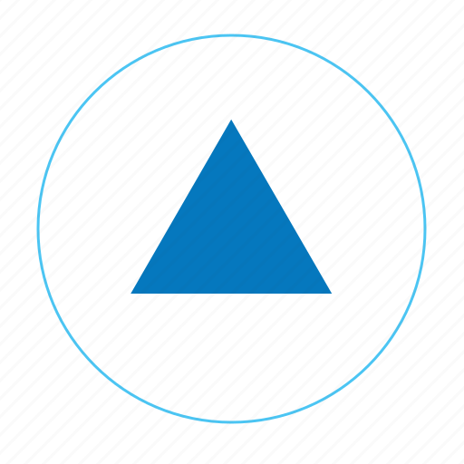

<kbd></kbd>

[Owline Live Site](https://owline.herokuapp.com)

# Table of Contents

- [Table of Contents](#table-of-contents)
- [Overview](#overview)
- [Goals](#goals)
  - [User's Goals](#users-goals)
  - [Site Owner's Goals](#site-owners-goals)
- [Design](#design)
  - [Frontend](#frontend)
    - [Colors](#colors)
    - [Font](#font)
  - [Backend](#backend)
    - [Data Models](#data-models)
- [Technologies](#technologies)
  - [Django Framework](#django-framework)
  - [Python](#python)
    - [Modules and Packages](#modules-and-packages)
  - [Other Software and Tools](#other-software-and-tools)
- [Features](#features)
  - [Existing Features](#existing-features)
    - [Navbar](#navbar)
    - [Login](#login)
    - [Signup](#signup)
    - [Ask Questions](#ask-questions)
    - [Answer Questions](#answer-questions)
    - [Imporve Question/ Answer](#imporve-question-answer)
    - [Delete Question/ Answer](#delete-question-answer)
    - [Register Votes](#register-votes)
    - [Accept Answers](#accept-answers)
    - [Search Questions](#search-questions)
    - [User Votes](#user-votes)
    - [Contact Us](#contact-us)
    - [Inbox](#inbox)
    - [Footer](#footer)
  - [Features Left to Implement](#features-left-to-implement)
    - [Tags](#tags)
    - [Reply to User Messages](#reply-to-user-messages)
- [Validations](#validations)
  - [Python](#python-1)
  - [Javascript](#javascript)
  - [HTML](#html)
  - [CSS](#css)
  - [Accessability](#accessability)
  - [Lighthouse](#lighthouse)
- [Testing](#testing)
  - [Manual Testing](#manual-testing)
  - [Automated Testing](#automated-testing)
  - [Bugs](#bugs)
- [Login Credentials](#login-credentials)
  - [Superuser](#superuser)
  - [Regular User](#regular-user)
- [Configurations](#configurations)
  - [Fork This Repository](#fork-this-repository)
  - [Make Local Clone](#make-local-clone)
  - [Deployment](#deployment)
- [Credits](#credits)
  - [Media](#media)
  - [Docs](#docs)
  - [Code](#code)
  - [Acknowledgements](#acknowledgements)

# Overview

# Goals

## User's Goals

## Site Owner's Goals

# Design

## Frontend

### Colors

### Font

## Backend

### Data Models

# Technologies

## Django Framework

## Python

### Modules and Packages

__Builts-in__ 

__Third Party__

## Other Software and Tools

# Features

## Existing Features

### Navbar

### Login

### Signup

### Ask Questions

### Answer Questions

### Imporve Question/ Answer

### Delete Question/ Answer

### Register Votes

### Accept Answers

### Search Questions

### User Votes

### Contact Us

### Inbox

### Footer

## Features Left to Implement

### Tags

### Reply to User Messages

# Validations

## Python

## Javascript

## HTML

## CSS

## Accessability

## Lighthouse

# Testing

## Manual Testing

## Automated Testing

## Bugs

# Login Credentials

## Superuser

## Regular User

# Configurations

## Fork This Repository

## Make Local Clone

## Deployment

# Credits

## Media

## Docs

## Code

## Acknowledgements

